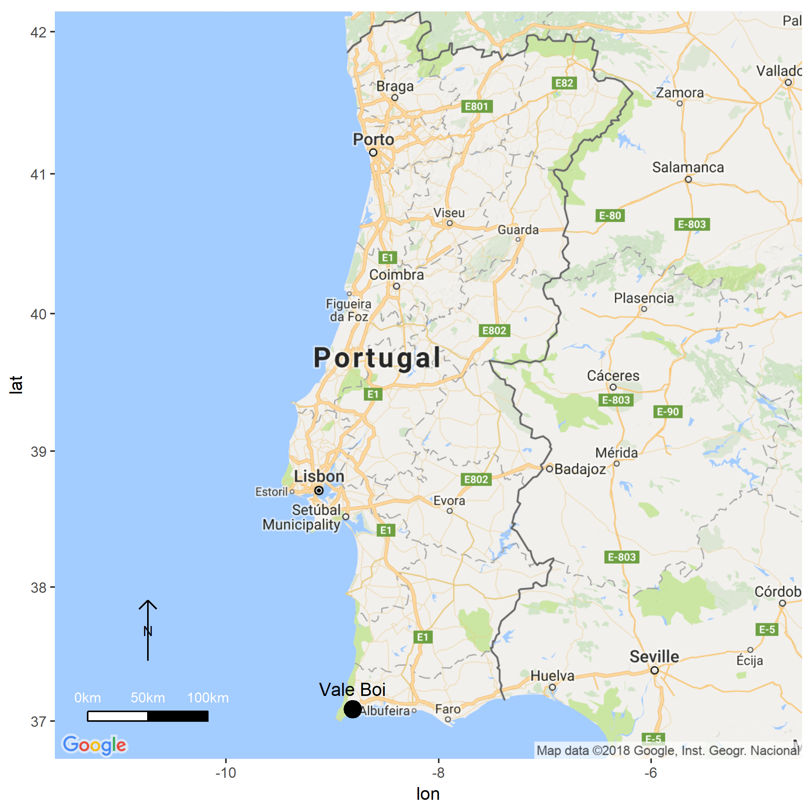

```{r, setup, include = FALSE, echo = FALSE}
knitr::opts_chunk$set(
  collapse = TRUE,
  warning = FALSE,
  message = FALSE,
  echo = FALSE,
  comment = "#>",
  dpi = 300,
  fig.width = 9,
  fig.path = "../figures/")

#library(ScaledPiecesVB) # Or use devtools::load_all('.', quiet = T) if your code is in script files, rather than as functions in the `/R` diretory
```

```{r load_libraries, echo = FALSE}

library(tidyverse)
library(FactoMineR)
library(factoextra)
library(ggpubr)
library(ggplot2)
library(ggrepel)
library(maptools)
library(ggmap)
library(devtools)
library(legendMap)
library(tab)

```

# Introduction

Bipolar technology is generically classified into two types of lithic artifacts - bipolar cores and scaled pieces (also known as splintered pieces or pièce esquilée). Their distinction, however, has not always been consensual (Hayden, 1980). In fact, the definition of scaled piece has suffered significant changes ever since its initial identification in the early 20th century and, to this day, there still seems to be no clear definition for this type of artifact. The first definition of scaled pieces was proposed by Baron and Bouysonnie (1906), describing them as a result of bipolar knapping through direct percussion, with the “core” rested in a hard surface, originating splintering in both ends of the tool. Since then, several other definitions were adopted and adapted by researchers for a very diverse set of contexts across the world (see e.g. Octobon, 1938; Sonneville-Bordes and Perot, 1956: 552; MacDonald; 1968:88; Hayden, 1980; Shott, 1989; Knight 1991:61).

Beyond the classification debate, the biggest issue with this type of tools comes from a functional standpoint, a problem that has also been quite debated (see e.g., Tixier, 1963; Binford and Quimby, 1963; Semenov, 1964; Flood, 1980:308; LeBlanc, 1992; Shott, 1999; Lucas and Hays, 2004; de la Peña, 2011; Igreja & Porraz, 2013). The issue surrounding this problem lies within the functional equifinality of these artifacts. Contrary to bipolar cores that are most of the times easily identified as cores, scaled pieces have been associated with two distinct types of activities: (1) as intermediate pieces or wedges for working hard raw materials (bone, ivory, antler, etc.); and (2) as cores for the extraction of chips and small bladelets (see e.g. Brantingham et al., 2004). Although largely debated, the ambiguity of this classification has, however, been ignored in some of the most recent literature, with some authors not acknowledging that bipolar evidence in stone tools might also result from other activities other than only reduction strategies (see e.g. Hiscock, 2015).

Most current studies on scaled pieces apply use-wear methods (e.g. Vaughan, 2002; Lucas & Hays, 2004; Bosinski, 2007; Gibaja et al. 2007; Sano, 2012; Igreja & Porraz, 2013, de la Peña, 2011; 2014; 2015a; 2015b, Bader et al., 2015), focusing on the identification of polishes and use-wear patterned stigmas, through both micro and macroscopic analysis of splintered surfaces and its comparison with experimental assemblages. Frequently, these studies coincide in interpreting scaled pieces as intermediate elements for the work of hard organic raw materials. The study by P. de la Peña (2011) is one of the most recent and relevant references in this regard. The author presents the results of an experimental program aiming to identify specific wear patterns in the use of bipolar techniques that allow the distinction between different types of activities/worked materials. Results indicate that while no visible differences can be identified in the percussion area, significant variation can be observed in the morphology of the areas in contact with the worked material.

As in many other regions and stone age periods across the world (e.g., Diez et. al 2009; Igreja & Porraz, 2013; Langjans, 2012; Leakey, 1971: 221; Leblanc, 1992; Shott, 1989, 1999; White, 1968), evidence of bipolar technologies are quite ubiquitous in European Upper Paleolithic contexts. In many sites, bipolar elements are classified as scaled pieces, a morphotype that has been putatively considered as one the most common lithic tools in Upper Paleolithic assemblages (de la Peña, 2015). Different functional connotations for this type of artifacts have been presented in several western european Upper Paleolithic studies (e.g., Zilhão, 1997; Aubry et al. 1998; de la Peña 2011; Sano, 2012).

In the case of the westernmost regions of Iberia, scaled pieces are commonly found in archaeological contexts ranging from the Upper Paleolithic to the Neolithic (e.g. Aubry et al. 1998; Bicho 1992; Carvalho 1998; Zilhão 1997). While scarce, the majority of Portuguese paleolithic studies (e.g. Almeida 2000, Gameiro 2012) do not offer analytical interpretations for the presence of scaled pieces, simply using references that interpret them as bipolar cores for the extraction of small bladelets and chips to be supposedly used in composite tools (as argued by Zilhão, 1997) or as intermediate pieces for working hard materials (Gibaja et al., 2007; Marreiros, 2009). Zilhão (1997) for example argues that the presence of scaled pieces throughout the Upper Paleolithic sequence of central Portugal is inversely proportional to the presence of “carinated cores”, and thus it is likely that the former should have worked as a flexible substitute for the latter. Carvalho (1998) agrees with this interpretation and considers it also valid for the Portuguese Early Neolithic.

While we agree that some of the elements might have been used as cores, these interpretations seem overly simplistic, and the authors seem to have little to no evidence to back their claims other than the inverse relationship mentioned above. This results in part from the lack of comprehensive studies regarding this type of artifacts at a regional scale. Additionally, the contexts from where most of these artifacts were recovered did not have good organic preservation and, thus, no direct association between these tools and the exploitation of hard-organic raw materials is possible, and, in face of the inexistence of any absolute dates, their precise chronological attribution is also, most of the times, unreliable.

In this paper, we present a first approach to the characterization of the morpho-technological variability and consequent role of scaled pieces during the Upper Paleolithic of the westernmost regions of Iberia (c. 32 000 – 10 000 cal BP). Using data from the multi-component, thoroughly dated, site of Vale Boi, located in southern Portugal, we present the analysis of a series of technological and morpho-functional attributes of a relatively large set of scaled pieces coming from one of the areas of the site. Using these data as a starting point, we then explore the relationship between the variability detected in the production and use of these artifacts with inter-site lithic technological patterns, and with the striking evidence for an intensification and diversification of faunal resources exploitation during the time-span under consideration.

\newline

# Vale Boi

The archaeological site of Vale Boi is located in the western edge of the Algarve region (southern Portugal) (Figure \@ref(fig:VBLocation)). The site can be found in a small valley following a river north-south for 2 km until it reaches the Atlantic Ocean. Archaeological deposits occupy an estimated area of over 10 000 sq. meters across a stepped slope marked at the top by a 10 meter-high limestone cliff face.

A complete sequence of Upper Paleolithic has been identified at Vale Boi, with all the traditionally-defined techno-complexes (Gravettian, Proto-Solutrean, Solutrean and Magdalenian) being identified across the three main excavation areas: the Terrace, the Rockshelter, and the Slope.

The Terrace area is located in the lower part of the hill. In this area, the longest archaeological sequence of the site can be found, including the complete Upper Paleolithic sequence but also three Holocene horizons, corresponding to Neolithic, Mesolithic and Epipaleolithic occupations (Bicho et al., 2012; Cascalheira et. al, 2017). From within the lower levels of this area, an Early Gravettian occupation was discovered, dated to c. 32 ka cal BP, being one of the earliest radiocarbon dates for anatomically modern humans in Southern Iberia (Bicho et al., 2016; Marreiros et al., 2015).

The Rockshelter area is a collapsed rock shelter located in the upper part of the slope, a couple of meters below the limestone cliff. This collapse would have occurred after the Last Glacial Maximum, since below the collapsed debris, several Solutrean occupations can be found, overlaying a sequence of very ephemeral Gravettian horizons (Marreiros, 2009; Cascalheira, 2009; Manne et al., 2012). The Solutrean is dated to between c. 20 ka and 25 ka cal BP (Cascalheira et al., 2012), while the Gravettian is dated between 26 ka and 32 ka cal BP (Marreiros et al., 2015).

Finally, the Slope section, from where the assemblage here presented is coming from, is composed of a series of excavation areas opened across the mid-hill sector of the site. These areas exhibit heterogeneous conditions in terms of site formation processes and archaeological preservation (Manne et al., 2012), but all revealed the presence of occupations attributed to the Gravettian, Proto-Solutrean, Solutrean and Magdalenian. Like in the previous areas, remains are well preserved, and high frequencies of lithic artifacts, malacological and mammalogical fauna and bone tools were recovered. No habitation features were identified in this area and based on the conditions and type of artifacts found, it has been suggested that this area would have functioned as a midden deposit (Bicho et al., 2010, 2012a).


```{r VBLocation, fig.cap=""}

Map()



```

\newline

## Lithic technology

Vale Boi’s lithic studies have revealed a general tendency for stable technological and functional patterns throughout the Upper Paleolithic (see e.g. Bicho et al., 2012; Gibaja and Bicho, 2006; Bradtmöller et. al, 2015; Marreiros, 2009, 2013, 2015; Cascalheira, 2009, 2013). This can be explained, partially, by raw material availability. Most raw materials were procured locally or regionally from deposits located at no more than 20 km away from the site (Bicho et al., 2010a). 
Chert was the most used rock type for more complex retouched tools production, while quartz and greywacke were mostly used for flake extraction and simple retouched tools production. Other raw materials can be found at the site, but much more restricted, both diachronically and functionally within each techno-complex and each archaeological horizon. Schist, for instance, shows up in some occupations almost exclusively connected to mobile art. Dolerite can only be found in the Proto-Solutrean levels, while chalcedony is mostly limited to the Proto-Solutrean and Solutrean levels.

Chert is the most abundant knapped rock type in Vale Boi. Throughout the several occupations, chert was considered the best rock type for knapping, which is evident by the way it was explored with much more complex strategies than either greywacke or quartz. While it can be said that chert exploration strategies were more elaborate, with exception of the bifacial technology during the Solutrean, they were still simple unidirectional reduction sequences producing mostly small debitage. Elongated products are found at very low frequencies across all chronologies. When present, retouched tools are mostly notches, denticulates, end-scrapers and, if considered, scaled pieces. One possible reason for these simplistic strategies seems to be an overall low knapping quality, since nodules are quite small, and frequently show a high degree of tectonically derived fractures (Pereira et al. 2016).

Two distinct types of quartz were identified at the site. The first is a thick grain, low-quality type, mostly inadequate for knapping. Still, this kind of quartz is present in large quantities and is most likely associated with stone boiling and grease rendering activities (Manne & Bicho, 2009; Manne, 2010; Bicho et al, 2012; Manne et al. 2012, 2014). The second type of quartz is characterized by finer-grain small pebbles with yellowish cortex. This type of quartz was knapped using rather simple strategies, mostly for small flake production, which in turn were used to produce simple and versatile tools (e.g. scaled pieces).

Greywacke was used for the rare production of flakes and choppers but shows up in the site mostly in the form of large slabs in which the identification of concavely shaped impact marks is thought to result from their use as anvils (Manne et. al, 2012, Manne & Bicho, 2009). The importance of greywacke anvils is indicated by its high frequency, with hundreds of slabs found in many levels throughout all occupations (Bicho et al, 2012; Manne et al. 2012). Greywacke was also knapped for flake extraction, using expedient unidirectional reduction strategies.

\newline

## Subsistence patterns

Organic preservation is good at Vale Boi. Faunal remains can be frequently found in every occupation, from both terrestrial and marine sources. Marine fauna at the site is marked by the presence of mollusks, crustaceans, some fish vertebrae and, in rare occasions, marine mammal remains (Manne, 2010). Regarding terrestrial fauna, three species dominate the vertebrate group: rabbit (Oryctolagus cuniculus), red deer (Cervus elaphus) and horse (Equus caballus). Smaller amounts of wild ass (Equus hydruntinus), aurochs (Bos primigenius), ibex (Capra pyrenaica) and wild boar (Sus scrofa) are also present (Manne, 2010, 2012, 2014). One of the most interesting patterns within the faunal assemblages is that a large portion of ungulate remains present specific types of fracture that have been associated with bone marrow extraction activities. Red deer and horse remains frequently show evidence of opposed cone fractures, trituration and smashing (Manne & Bicho, 2009; Manne, 2010, 2012, 2014).

Ungulates would have been hunted and processed in a similar fashion throughout the Upper Paleolithic. While there were conditions for the whole bones to be preserved, these bones are frequently anthropically broken. These fragmentation patterns seem to be linked to grease rendering activities (Manne, 2010, 2012, 2014). The main goal of grease rendering is to obtain grease, through heat exposure from animal bones, as it has a very high caloric value. Other than this, this grease could have many uses with the addition of being easily stored and transported (Manne, 2012). The spongeous bone parts would be fragmented and deposited in a hole, covered with animal pelts full of water, after which, pre-heated rock fragments were added. The high temperature of the rocks would make the water boil and therefore separate the grease from the spongeous bones creating a highly nutritional stew (Manne, 2014). After being cooled the grease would accumulate at the top where it could be easily removed, transported and stored. Unlike simple bone marrow extraction, this method involved large preparation, including water transport, fire, and heat production, rock heating, and finally the storing of the grease (Manne, 2014).

These grease rendering techniques are thought to be quite common at the site since the parts of the bones with higher amounts of fat are missing despite the good preservation of the rest of the remains (Manne et al. 2012). Fragmented ungulate remains show up in the site connected to large amounts of thermo-altered quartz, anvils, hard hammers and scaled pieces. This suggests that red deer and horse bones were processed and afterward intensively grease rendered (Manne & Bicho, 2009; Manne, 2010, 2012, 2014). To confirm this, a single scaled piece was found stuck to a cracked phalanx in a Gravettian horizon (Manne, 2012).

\newline

# Methods

## Scaled pieces attribute analysis

Attribute analysis was split into two main groups, each corresponding to two distinct types of features: (1) technological attributes and (2) morpho-functional attributes.

In the first group, a series of variables traditionally used in lithic studies (e.g. Andrefsky, 2005; Inizan et. al, 1999) were recorded (Table \@ref(tab:tech_attributes)), aiming to characterize patterns of blank choice for the application of bipolar technology.

For the second group of variables a macroscopic approach, building upon the work of de la Peña (2011) and Fischer et. al (1984) was adopted (Table \@ref(tab:morph_attributes)). Studies by Vaughan (2002), Sano (2012), and Gibaja et al. (2007) indicate that since use-wear traces are formed before the splintering, the removal of small chips removes most of the polishes and use-wear traces left by the contact with the static element (either a stone anvil or a hard-organic materials). This prevented us to pursue a microscopic use-wear approach in this study.

\newline

```{r tech_attributes}


```

\newline

```{r morph_attributes}


```

Macroscopic morpho-functional attributes were separately analyzed for each damaged platform, aiming to detect patterns of morphological change that occurred in artifacts during use. Following the work of de la Peña (2011, 2015) and Gonzalez-Urquijo & Ibanez-Estévez (1994), we expected that these attributes would be indicative of which function the artifacts had. For instance, according to de la Peña (2011, 2015), for pieces used as wedges, the shape of the passive platform remains the same and the other varies according to the type of material worked on the active platform. Furthermore, these pieces would have irregular shapes, variable scar size, and irregular scar distribution. On the other hand, pieces used as bipolar cores would have squared or rectangular shapes, symmetric straight platforms, and a higher frequency of scars on the striking edge than on the active edge. The addition of other attributes expanding on the work by Gonzalez-Urquijo & Ibanez-Estévez (1994) was made following the same reasoning. We expected, thus, to be able to differentiate pieces used as wedges from pieces used as cores, as both groups would show distinct combinations of attributes. To assist us with this differentiation we tested the presence of the referred patterns within our assemblage using descriptive and multivariate statistical analysis and comparing it with the data described by the referred authors.

\newline

# Results

A total of 139 scaled pieces were analyzed, of which 42.4% come from Gravettian, and 45.3% from Solutrean levels, as shown in (Table(@ref(tab:assemblage)).The assemblage was divided into 4 main chronological groups: Magdalenian, Solutrean, Proto-Solutrean, and Gravettian.

As previously mentioned, as far as the technological data is concerned, one of our main objectives was to characterize and understand the choice of blanks involved in bipolar technology. We did not include the metric data, as most of the data from the original blank are mostly gone due to reduction and use. Overall, the technological analysis revealed some trends that lasted throughout the Upper Paleolithic, in agreement with the general patterns of lithic technology in the site (see above).

\newline

```{r assemblage, echo = FALSE}

var_list <- c("Chronology")

assemb <- cross_tb(dataset, "RawMaterial", var_list)

assemb <- assemb %>%
  as.tibble() %>% 
  dplyr::select(" " = Variable, Chert, Quartz, Chalcedony, Total = Overall)

knitr::kable(assemb, caption= "")

```

\newline

Across all techno-complexes, blanks used were either flakes or unclassifiable fragments, but the choice seems to be different for each raw material. For quartz, in the Gravettian assemblage, the blank types are almost equally split between flakes and unclassifiable fragments (Table(@ref(tab:technogravettian)). In other periods, flakes were the preferred type of blank (Tables(@ref(tab:technosolutrean)(@ref(tab:technoproto)(@ref(tab:technomagdalenian)). Regarding chert, in every occupation flakes dominate the assemblages, followed by a reduced number (4) of unclassifiable fragments. Chalcedony blanks were exclusively flakes.

\newline

```{r technology, echo=FALSE}

# Pull dataset
techno_data <- read_data()

# Set variables
var_list <- c("Blank","CrossSection","Profile","Blankshape","X.Cortex","ButtType","Profile")

# Filter by chronology
filter <- split(techno_data, techno_data$Chronology)

# Get cross-tables by chronology using cross_tb() function
Gravettian <- cross_tb(filter$Gravettian, "RawMaterial", var_list) 
Gravettian <- select(Gravettian, " ", Chert, Quartz, Total)

Solutrean <- cross_tb(filter$Solutrean, "RawMaterial", var_list)

`Proto-Solutrean` <- cross_tb(filter$`Proto-Solutrean`, "RawMaterial", var_list)

Magdalenian <- cross_tb(filter$Magdalenian, "RawMaterial", var_list)
Magdanelian <- select(Magdalenian, " ", Chert, Quartz, Total)


```

\newline

```{r technogravettian, echo=FALSE}

knitr::kable(Gravettian, caption= "")

```

\newline

```{r technoproto, echo=FALSE}

knitr::kable(`Proto-Solutrean`, caption= "")

```

\newline

```{r technoSolutrean, echo=FALSE}

knitr::kable(Solutrean, caption= "")

```

\newline

```{r technomagdalenian, echo=FALSE}

knitr::kable(Magdalenian, caption= "")

```

\newline

Technological and morphological characteristics of the flake blanks present very similar patterns across time and amongst raw materials. The blanks sought after would have the following characteristics: straight profile, parallel edges, no-cortex and trapezoidal or triangular shaped transversal sections.

Other characteristics of the assemblage are the small frequency of retouched pieces, fire alterations, and of the original striking platforms. Still, when present, retouch was located in the lateral part of the artifacts, similar to what would define a side-scraper. In a very small number of cases, striking platforms were detected, mostly with a flat morphology. The absence of the original blank platforms is to be expected in this type of artifact, mostly due to the functional use of the pieces, and consequent removal of the platform, rather than an actual choice.

When identifiable, the technological and typological axes tend to coincide, although in many cases the technological axis could not be identified, especially in quartz pieces. The longitudinal section shows a large variability of shapes, independent of raw material or chronology. Similarly, the dorsal pattern of previous removals was rarely identified, although this, like with the case of the butt absence, might occur due to the functional stigmas.

The patterns of use and rotation of damaged platforms seem to be the same across all chronologies. In every assemblage quartz pieces were exclusively used in one single axis, exhibiting only two damaged platforms. On the other end, some (3,38%) chert and chalcedony artifacts exhibit multiple functional axis, with three or four damaged platforms. This seems to indicate different strategies of curation for coarse and fine grain raw materials.

In scaled pieces, metrics are a difficult set of variables to clearly show as results. These attributes are impacted by both the initial blank size as well as by the functional use and reduction. The pieces showed lengths ranging from 10 mm to 45 mm, widths ranging from 8 mm to 35 mm and thicknesses ranging from 3 mm to 20 mm. In general, quartz scaled pieces tend to be larger and thicker than chert and chalcedony pieces. On the other hand, chert pieces tend to be wider than the rest.

```{r meanplots, echo = FALSE, fig.cap=""}


length <- mean_plot(techno_data, "Chronology", "AxisLength", "RawMaterial")
width <- mean_plot(techno_data, "Chronology", "AxisWidth", "RawMaterial")
thickness <- mean_plot(techno_data, "Chronology", "Thickness", "RawMaterial")


meanplots <- ggarrange(length, width, thickness, ncol = 1, nrow = 3, labels = c("A", "B", "C"), common.legend = TRUE, legend = "right")

meanplots

```


#Discussion


#Conclusion


#Acknowledgements


##### pagebreak


# References 
<div id="refs"></div>

##### pagebreak

### Colophon

This report was generated on `r Sys.time()` using the following computational environment and dependencies: 

```{r colophon, cache = FALSE}
# which R packages and versions?
devtools::session_info()
```

The current Git commit details are:

```{r}
# what commit is this file at? You may need to change the path value
# if your Rmd is not in analysis/paper/
git2r::repository("../..")
```
