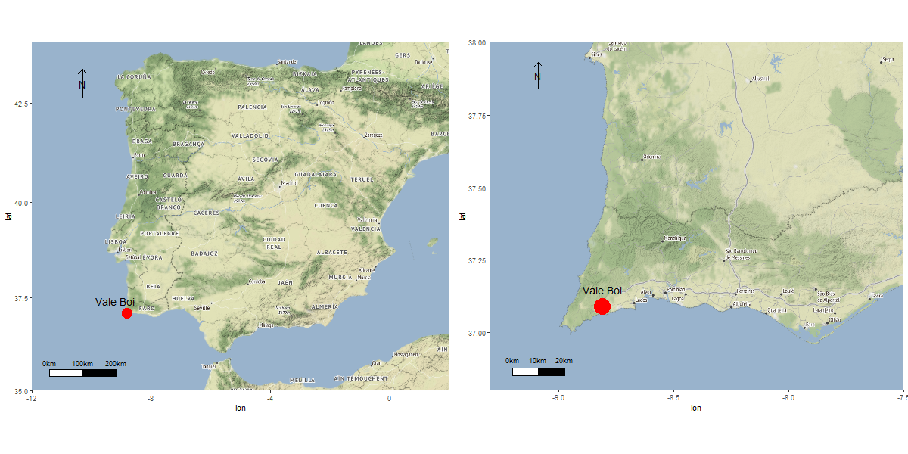

\newline

# Abstract

  Scaled or splintered pieces are one of the most common lithic artifacts type in Upper Paleolithic assemblages throughout Europe, especially in its westernmost regions. Despite this, and even after one century of being identified there is still no consensus on how to define, analyze or interpret these tools. In western Iberia there is a clear lack of comprehensive studies regarding this type of artifacts at a regional scale. In this paper we present a first techno-morphological analysis of a sample of scaled pieces from the Upper Paleolithic site of Vale Boi. Our first aim was to build upon existing analytical models in order to identify function and possible reduction strategies for these artifacts. Our second goal was to critically evaluate the role of these artifacts within western Iberia’s Upper Paleolithic.
  Our results showed that functional identification of scaled pieces is still not clear. By comparing our data with other author’s we found that current models could not be applied to the archaeological record, as the attribute variability is too high. Furthermore, in this region we found that higher frequencies of bipolar technology can be found related to residential sites due to both functional and cultural patterns. While we still cannot define a specific function for these artifacts (intermediate pieces or wedges for working hard raw materials or cores for the extraction of chips and small bladelets), it is clear that they had a major role in the variability and intensification of resource exploitation during the Upper Paleolithic in western Iberia.

\newline

# Keywords

Stone tools; Bipolar technology; Upper Paleolithic; Western Europe


```{r, setup, include = FALSE, echo = FALSE}

knitr::opts_chunk$set(
  collapse = TRUE,
  warning = FALSE,
  message = FALSE,
  echo = FALSE,
  comment = "#>",
  dpi = 300,
  fig.width = 9,
  fig.path = "../figures/")
  cache = TRUE

```


```{r load_libraries, echo = FALSE}

library(ScaledPiecesVB)

load.packages()

all_data <- read.data()
techno_data <- all_data$techno_data
morpho_data <- all_data$morpho_data

```

# Introduction

Bipolar technology is generically classified into two types of lithic artifacts - bipolar cores and scaled pieces (also known as splintered pieces or *pièce esquilée*). Their distinction, however, has not always been consensual [@hayden_confusion_1980]. Besides the fact that bipolar cores are often confused or lumped with scaled pieces [@villa_neandertals_2018], the definition of scaled piece has suffered significant changes ever since its initial identification in the early 20th century and, to this day, there still seems to be no clear definition for this type of artifact. The first definition of scaled pieces was proposed by Bardon and Bouyssonie [-@bardon_outils_1906], describing them as a result of bipolar knapping through direct percussion, with the “core” rested in a hard surface, originating splintering in both ends of the tool. Since then, several other definitions were adopted and adapted by researchers for a very diverse set of contexts across the world [e.g. @hayden_confusion_1980; @macdonald_debert:_1985; @octobon_contribution_1938; @shott_bipolar_1989; @sonneville-bordes_lexique_1956].

Beyond the classification debate, the biggest issue with this type of tools comes from a functional standpoint, a problem that has also been largely debated [e.g. @binford_indian_1963; @de_la_pena_sobre_2011; @flood_moth_1980; @igreja_functional_2013; @leblanc_wedges_1992; @lucas_les_2004; @shott_bipolar_1999; @tixier_typologie_1963]. The issue surrounding this problem lies within the functional equifinality of these artifacts. Contrary to bipolar cores that are most of the times easily identified as cores, scaled pieces have been associated with two distinct types of activities: (1) as intermediate pieces or wedges for working hard raw materials (e.g. bone, ivory, antler); and (2) as cores for the extraction of chips and small bladelets [@brantingham_early_2004]. Although largely debated, the ambiguity of this classification has, however, been ignored in some of the most recent literature, with some authors not acknowledging that bipolar evidence in stone tools might also result from other activities other than only reduction strategies [see e.g. @hiscock_dynamics_2015].

Most current studies on scaled pieces apply use-wear methods [e.g. @bader_lithic_2015; @de_la_pena_interpretation_2015; @de_la_pena_new_2014; @de_la_pena_qualitative_2015; @de_la_pena_sobre_2011; @gibaja_tecnologiy_2007; @igreja_functional_2013; @lucas_les_2004; @sano_functional_2012], focusing on the identification of polishes and use-wear patterned stigmas, through both micro and macroscopic analysis of splintered surfaces and its comparison with experimental assemblages. Frequently, these studies coincide in interpreting scaled pieces as intermediate elements for the work of hard organic raw materials. The study by P. de la Peña [-@de_la_pena_sobre_2011; -@de_la_pena_qualitative_2015] is one of the most recent and relevant references in this regard. The author presents the results of an experimental program aiming to identify specific wear patterns in the use of bipolar techniques that allow the distinction between different types of activities and worked materials. Results indicate that while no visible differences can be identified in the percussion area, significant variation can be observed in the morphology of the areas in contact with the worked material.  

As in many other regions and stone age periods across the world [e.g. @diez-martin_were_2009; @igreja_functional_2013; @langejans_middle_2012; @white_fabricators_1968], evidence of bipolar technologies are quite ubiquitous in European Upper Paleolithic contexts. In many sites, bipolar elements classified as scaled pieces have been associated with different functionalities [see e.g. @de_la_pena_sobre_2011; @sano_functional_2012; @zilhao_o_1997].

In the case of the westernmost regions of Iberia, scaled pieces are commonly found in archaeological contexts ranging from the Upper Paleolithic to the Neolithic [e.g. @bicho_technological_2000; @carvalho_talhe_1998; @zilhao_o_1997]. While scarce, the majority of portuguese paleolithic studies [e.g. @almeida_terminal_2000; @goncalves_variabilite_2012] have not presented, so far, any context-specific interpretations for the presence of scaled pieces. Most references broadly interpret these as bipolar cores for the extraction of small bladelets and chips to be  used in composite tools [e.g. @zilhao_o_1997], or as intermediate pieces for working hard materials [@gibaja_tecnologiy_2007; @marreiros_as_2009]. Zilhão [-@zilhao_o_1997], for example, argues that the presence of scaled pieces throughout the Upper Paleolithic sequence of central Portugal is inversely proportional to the presence of “carinated cores”, and thus it is likely that the former should have worked as a flexible substitute for the latter. Carvalho [-@carvalho_talhe_1998] agrees with this interpretation and considers it also valid for the portuguese early Neolithic.

While we agree that some of the elements might have been used as cores, these interpretations seem overly simplistic, and the authors seem to have little to no evidence to back their claims other than the inverse relationship mentioned above. This results, in part, from the lack of comprehensive studies regarding this type of artifacts at a regional scale. Additionally, the contexts from where most of these artifacts were recovered did not have good organic preservation and, thus, no direct association between these tools and the exploitation of hard-organic raw materials is possible, and, in face of the nonexistence of any absolute dates, their precise chronological attribution is also, most of the times, unreliable.

In this paper, we present a first approach to the characterization of the morpho-technological variability and consequent role of scaled pieces during the Upper Paleolithic of the westernmost regions of Iberia (c. 32–10 ka cal BP). Using data from the multi-component, thoroughly dated, site of Vale Boi, located in southern Portugal, we present the analysis of a series of technological and morpho-functional attributes of a relatively large set of scaled pieces coming from one of the areas of the site. Using these data as a starting point, we then explore the relationship between the variability detected in the production and use of these artifacts with inter-site lithic technological patterns, and with the striking evidence for an intensification and diversification of faunal resources exploitation during the time-span under consideration.

\newline

# Vale Boi

The archaeological site of Vale Boi is located in the western edge of the Algarve region (southern Portugal) (Figure \@ref(fig:VBLocation)). The site can be found in a small valley following a river north-south for 2 km until it reaches the Atlantic Ocean. Archaeological deposits occupy an estimated area of over 10 000 sq. meters across a stepped slope marked at the top by a 10 meter-high limestone cliff face [@bicho_ledge:_2012; @bicho_paleolithique_2010].

A rather complete Upper Paleolithic sequence has been identified at Vale Boi, with all the traditionally-defined techno-complexes (Gravettian, Proto-Solutrean, Solutrean and Magdalenian) being identified across the three main excavation areas: the Terrace, the Rockshelter, and the Slope.

The Terrace area is located in the lower part of the hill. In this area, the longest archaeological sequence of the site can be found, including the complete Upper Paleolithic sequence but also three Holocene horizons, corresponding to Neolithic, Mesolithic and Epipaleolithic occupations [@bicho_ledge:_2012; @cascalheira_cross-scale_2017]. From within the lower levels of this area, an Early Gravettian occupation was discovered, dated to c. 32 ka cal BP, being one of the earliest radiocarbon dates for anatomically modern humans in Southern Iberia [@bicho_ecodynamics_2013; @marreiros_lithic_2015].

The Rockshelter area is a collapsed rock shelter located in the upper part of the slope, a couple of meters below the limestone cliff. This collapse would have occurred after the Last Glacial Maximum, since below the collapsed debris, several Solutrean occupations can be found, overlaying a sequence of very ephemeral Gravettian horizons [@cascalheira_vale_2012; @manne_intensive_2012; @marreiros_as_2009]. The Solutrean is dated to between c. 20 ka and 25 ka cal BP [@cascalheira_chronological_2015], while the Gravettian is dated between 26 ka and 32 ka cal BP [@marreiros_lithic_2015].

Finally, the Slope section, from where the assemblage here presented is coming from, is composed of a series of excavation areas opened across the mid-hill sector of the site. These areas exhibit heterogeneous conditions in terms of site formation processes and archaeological preservation [@manne_intensive_2012], but all revealed the presence of occupations attributed to the Gravettian, Proto-Solutrean, Solutrean and Magdalenian. Like in the previous areas, remains are well preserved, and high frequencies of lithic artifacts, malacological and mammalogical fauna and bone tools were recovered. No habitation features were identified in this area and based on the conditions and type of artifacts found, it has been suggested that this area would have mostly functioned as a midden deposit [@bicho_ledge:_2012; @bicho_paleolithique_2010].

\newline

```{r VBLocation, echo = FALSE, fig.cap="Location of the site of Vale Boi. Map data are from stamenmap, using the ggmap package Kahle and Wickham [-@kahle_ggmap:_2013]"}

# Map()
# The function above is used to build the map shown below. Since the map is saved in the figures folder of the compendium it is not needed to run this function again.



```

\newline

## Lithic technology

Vale Boi’s lithic studies have revealed a general tendency for stable technological and functional patterns throughout the Upper Paleolithic [e.g. @bicho_ledge:_2012; @bradtmoller_lithic_2016; @cascalheira_cross-scale_2017; @cascalheira_influencia_2013; @cascalheira_vale_2012; @gibaja_funcion_2011; @marreiros_as_2009; @marreiros_lithic_2013; @marreiros_lithic_2015; @marreiros_lithic_2018]. This can be explained, partially, by raw material availability. Most raw materials were procured locally, or regionally from deposits located at no more than 20 km away from the site [@bicho_paleolithique_2010]. 
Chert was the most used rock type for more complex retouched tools production, while quartz and greywacke were mostly used for flake extraction and simple retouched tools production. Other raw materials can be found at the site, but much more restricted, both diachronically and functionally, within each techno-complex. Schist, for instance, shows up in some occupations almost exclusively connected to mobile art. Dolerite is only  found in the Proto-Solutrean levels [@belmiro_o_2017], while chalcedony is mostly limited to the Proto-Solutrean and Solutrean levels [@cascalheira_vale_2012].

Chert is the most abundant knapped rock type in Vale Boi. Throughout the several occupations, chert was considered the best rock type for knapping, which is evident by the way it was explored with much more complex strategies than either greywacke or quartz. While it can be said that chert exploration strategies were more elaborate, the most common strategies were still simple unidirectional or bidirectional reduction sequences, producing mostly flakes [@marreiros_flake_2012]. Elongated products are found at low frequencies across all chronologies. When present, retouched tools are mostly notches, denticulates, end-scrapers, and scaled pieces. One possible reason for these simplistic strategies seems to be an overall low knapping quality, since nodules are quite small, and frequently show a high degree of tectonically derived fractures [@pereira_territory_2016].

Two distinct types of quartz were identified at the site. The first is a thick grain, low-quality type, mostly inadequate for knapping. Still, this kind of quartz is present in large quantities and is most likely associated with stone boiling and grease rendering activities [@bicho_ledge:_2012; @manne_early_2014; @manne_intensive_2012; @manne_upper_2010; @manne_vale_2009]. The second type of quartz is characterized by finer-grain small pebbles with yellowish cortex. This type of quartz was knapped using rather simple strategies, mostly for small flake production, which in turn were used to produce simple and versatile tools.

Greywacke is the third most frequent raw material at Vale Boi, showing up in the site mostly in the form of large slabs, in which the identification of concavely shaped impact marks is thought to result from their use as anvils. The importance of greywacke anvils is indicated by its high frequency, with hundreds of slabs found in many levels throughout all occupations [@bicho_ledge:_2012; @manne_intensive_2012]. Greywacke was also knapped for flake extraction, using expedient unidirectional reduction strategies [@cascalheira_influencia_2013; @marreiros_as_2009].

\newline

## Subsistence patterns

Organic preservation is fairly good at Vale Boi. Faunal remains can be frequently found in all occupations, both of terrestrial and marine resources. Marine fauna at the site is marked by the presence of mollusks, crustaceans, some fish vertebrae and, in rare occasions, marine mammal remains [@manne_upper_2010]. Regarding terrestrial fauna, three species dominate the vertebrate group: rabbit (*Oryctolagus cuniculus*), red deer (*Cervus elaphus*) and horse (*Equus caballus*). Smaller amounts of wild ass (*Equus hydruntinus*), aurochs (*Bos primigenius*), ibex (*Capra pyrenaica*) and wild boar (*Sus scrofa*) are also present [@manne_early_2014; @manne_intensive_2012; @manne_upper_2010]. One of the most interesting patterns within the faunal assemblages is that a large portion of ungulate remains present specific types of fracture that have been associated with bone marrow extraction activities. Red deer and horse remains frequently show evidence of opposed cone fractures, trituration and smashing [@manne_early_2014; @manne_intensive_2012; @manne_upper_2010; @manne_vale_2009].

Ungulates would have been hunted and processed in a similar fashion throughout the Upper Paleolithic. While there were conditions for the whole bones to be preserved, these bones are frequently anthropically broken. These fragmentation patterns seem to be linked to grease rendering activities [@manne_early_2014; @manne_intensive_2012; @manne_upper_2010]. The main goal of grease rendering is to obtain grease, through heat exposure from animal bones, as it has a very high caloric value. Other than this, this grease could have many uses with the addition of being easily stored and transported [@manne_intensive_2012]. The spongeous bone parts would be fragmented and deposited in a hole, covered with animal pelts full of water, after which, pre-heated rock fragments were added. The high temperature of the rocks would make the water boil and therefore separate the grease from the spongeous bones creating a highly nutritional stew. After being cooled the grease would accumulate at the top where it could be easily removed, transported and stored. Unlike simple bone marrow extraction, this method involved large preparation, including water transport, fire, and heat production, rock heating, and finally the storing of the grease [@manne_early_2014].

These grease rendering techniques are thought to be quite common at the site since the parts of the bones with higher amounts of fat are missing despite the good preservation of the rest of the remains. Fragmented ungulate remains show up in the site connected to large amounts of thermo-altered quartz, anvils, hard hammers and scaled pieces. This suggests that red deer and horse bones were processed and afterward intensively grease rendered. To confirm this, a single scaled piece was found stuck to a cracked phalanx in a Gravettian horizon [@manne_early_2014; @manne_intensive_2012; @manne_upper_2010; @manne_vale_2009].

\newline

# Methods

## Scaled pieces attribute analysis

We define scaled pieces as artifacts of variable size and morphology, showing traces of crushing and splitering of edges at opposite ends. These traces are caused by direct percussion at one end and subsequent crushing of the other because it is rested on a hard surface, and can be bifacially or unifacially distributed. As will become clear from our results, some of the analyzed artifacts did not present splitering/crushing traces in opposed platforms, but we still classified them as scaled pieces. This detail has been previously referred by Villa et al. [-@villa_neandertals_2018] who noted that some edges may present a flat (instead of intensively shattered) platforms.

Attribute analysis was split into two main groups, each corresponding to two distinct types of features: (1) technological attributes and (2) morpho-functional attributes. In the first group, a series of variables traditionally used in lithic studies [e.g. @andrefsky_jr_lithics:_2005; @inizan_technology_1999] were recorded (see Supplementary Materials for full list of variables), aiming to characterize patterns of blank choice for the application of bipolar technology. For the second group of variables, a macroscopic approach building upon the work of de la Peña [-@de_la_pena_sobre_2011] and Fischer et. al [-@fischer_macro_1984] was adopted (see Supplementary Materials for full list of variables). Studies by Sano [-@sano_functional_2012], and Gibaja et al. [-@gibaja_tecnologiy_2007] indicate that, since use-wear traces are formed before the splintering, the removal of small chips removes most of the polishes and use-wear traces left by the contact with the static element (either a stone anvil or a hard-organic materials). This, together with the large presence of quartz artifacts in our sample, prevented us to pursue a microscopic use-wear approach for this study in particular.

\newline

Macroscopic morpho-functional attributes were separately analyzed for each damaged platform, aiming to detect patterns of morphological change that occurred in artifacts during use. Following the work of de la Peña [-@de_la_pena_qualitative_2015; -@de_la_pena_sobre_2011] and Gonzalez-Urquijo and Ibanez-Estévez [-@gonzalez-urquijo_metodologialisis_1994], we expected that these attributes would be indicative of which function the artifacts had. For instance, according to de la Peña [-@de_la_pena_qualitative_2015; -@de_la_pena_sobre_2011], for pieces used as wedges the delineation of the damaged platforms are constantly asymmetrical and only the hammered edge clearly shows the typical *écaille* retouch. Furthermore, these pieces would have irregular shapes, variable scar size, and irregular scar distribution. On the other hand, pieces used as bipolar cores would have squared or rectangular shapes, symmetric straight damaged platforms, and a higher frequency of scars on the hammered edge than on the opposed edge. The addition of other attributes drawing upon the work by Gonzalez-Urquijo and Ibanez-Estévez [-@gonzalez-urquijo_metodologialisis_1994] was made following the same reasoning. We expected, thus, to be able to differentiate pieces used as wedges from pieces used as cores, as both groups would show distinct combinations of attributes. To assist us with this differentiation we tested the presence of the referred patterns within our assemblage using descriptive and multivariate statistical analysis and comparing it with the data described by the referred authors.

\newline

## Analysis, reproducibility and open source materials

All analyses and data processing were accomplished in R (version `r getRversion()`) [@r_core_team_r:_2013]. Following recent concerns on the reproducibility of archaeological analysis we include the entire R code used for all the analysis and visualizations contained in this paper in our supplemental online material (SOM) at https://dx.doi.org/10.17605/OSF.IO/WPXGH To produce those files we followed the procedures described by Marwick et al. [-@marwick_packaging_2017] for the creation of research compendiums to enhance the reproducibility of research. The files provided contain all the raw data used in our analysis as well as a custom R package [@wickham_r_2015] holding the code use for all analysis and to produce all tables and figures. To enable maximum re-use, our code is released under the MIT license, our data as CC-0, and our figures as CC-BY, [for more information see @marwick_computational_2016].

\newline

# Results

A total of `r summarise(techno_data, n())` scaled pieces were analyzed, of which `r round(techno_data %>% filter(Chronology == "Gravettian") %>% summarise(n = n()) %>% mutate(n = (n / 139)*100), 2)`% come from Gravettian, and `r round(techno_data %>% filter(Chronology == "Solutrean") %>% summarise(n = n()) %>% mutate(n = (n / 139)*100), 2)`% from Solutrean levels, as shown in Table (\@ref(tab:assemblage)). In terms of raw materials, the great majority of pieces were either made on quartz or chert, with chalcedony being represented only by `r round(techno_data %>% filter(RawMaterial == "Chalcedony") %>% summarise(n = n()), 2)` artifacts.

\newline

```{r assemblage, echo = FALSE}

var_list <- c("Chronology")

assemb <- as.tibble(cross.tb(techno_data, "RawMaterial", var_list))

assemb <- assemb %>%
  select(" " = "Variable", "Chert", "Quartz", "Chalcedony", "Total" = "Overall") %>% 
  slice(2:5)

assemb <- assemb[c(1,3,4,2),]

knitr::kable(assemb, caption= "Frequencies of scaled pieces used in this study, by raw material and chronological period. Percentages are shown in parentheses")

```

\newline

As previously mentioned, concerning technological data, one of our main objectives was to characterize the choice of blanks involved in bipolar technology. Overall, the technological analysis revealed some trends that lasted throughout the Upper Paleolithic, in agreement with the general patterns of lithic technology recorded for the site. Across all techno-complexes, blanks used were either flakes or unclassifiable fragments, but the choice seems to be different for each raw material. For quartz, in the Gravettian assemblage, the blank types are almost equally split between flakes and unclassifiable pieces (Table \@ref(tab:technogravettian)). In other periods, flakes were the preferred type of blank (Tables \@ref(tab:technosolutrean), \@ref(tab:technoproto) and \@ref(tab:technomagdalenian)). Regarding chert, in every occupation flakes dominate the assemblages, followed by a reduced number (n = `r techno_data %>% filter(RawMaterial == "Chert" & Blank == "Non_identifiable") %>% summarise(n())`) of unclassifiable blanks. The small sample of chalcedony blanks is exclusively represented by flakes.

Technological and morphological characteristics of the flake blanks present very similar patterns across time and among raw materials. The blanks sought after would have straight profiles, parallel edges, no cortical surfaces and trapezoidal or triangular shaped cross-sections.

Other characteristics of the assemblage are the low frequency of retouch (n = `r techno_data %>% filter(RetouchedBlank == "Yes") %>% summarise(n())`), of fire alterations (n = `r techno_data %>% filter(Fire != "No_Traces") %>% summarise(n())`), and of the presence of original striking platforms (n = `r techno_data %>% filter(ButtType != "Absent") %>% summarise(n())`). Still, when present, retouch is located in the lateral part of the artifacts, similar to what would define a side-scraper. In a very small number of cases, when striking platforms are present, these are mostly flat. The absence of the original blank platforms is to be expected in this type of artifact, mostly due to the functional use of the pieces, and consequent removal of the platform, rather than an actual choice. The large absence of platforms may, also, be the result of the use of the technological axis as main functional axis. In fact, when identifiable, technological and typological axes coincide in `r inline.perc(techno_data, AxisCoincident, "Yes")`% of the cases. The longitudinal sections show a large variability of shapes, independent of raw materials or chronologies. Similarly, the dorsal pattern of previous removals was rarely identified, although this, like with the case of platform absence, might occur due to the functional stigmas and be dependent on the intensity of use for each artifact.

\newline

```{r technology, include = FALSE, echo=FALSE}

# Set variables
var_list <- c("Blank","CrossSection","Profile","Blankshape","Cortex","ButtType","Profile")

# Filter by chronology
filter <- split(techno_data, techno_data$Chronology)

# Get cross-tables by chronology using cross_tb() function
Gravettian <- cross.tb(filter$Gravettian, "RawMaterial", var_list) 
Gravettian <- Gravettian %>% 
  as.tibble() %>% 
  select(" " = Variable, Chert, Quartz, Total = Overall)

Solutrean <- cross.tb(filter$Solutrean, "RawMaterial", var_list)
Solutrean <- Solutrean %>% 
  as.tibble() %>% 
  select(" " = Variable, Chert, Quartz, Chalcedony, Total = Overall)

`Proto-Solutrean` <- cross.tb(filter$`Proto-Solutrean`, "RawMaterial", var_list)
`Proto-Solutrean` <- `Proto-Solutrean` %>% 
  as.tibble() %>% 
  select(" " = Variable, Chert, Quartz, Chalcedony, Total = Overall)

Magdalenian <- cross.tb(filter$Magdalenian, "RawMaterial", var_list)
Magdalenian <- Magdalenian %>% 
  as.tibble() %>% 
  select(" " = Variable, Chert, Quartz, Total = Overall)

```

\newline

```{r technogravettian, echo=FALSE}

knitr::kable(Gravettian, caption= "Technological attributes frequencies by raw materials for the Gravettian sample. Percentages are shown in parentheses.")

```

\newline

```{r technoproto, echo=FALSE}

knitr::kable(`Proto-Solutrean`, caption= "Technological attributes frequencies by raw materials for the Proto-Solutrean sample. Percentages are shown in parentheses.")

```

\newline

```{r technosolutrean, echo=FALSE}

knitr::kable(Solutrean, caption= "Technological attributes frequencies by raw materials for the Solutrean sample. Percentages are shown in parentheses.")

```

\newline

```{r technomagdalenian, echo=FALSE}

knitr::kable(Magdalenian, caption= "Technological attributes frequencies by raw materials for the Magdalenian sample. Percentages are shown in parentheses.")

```

\newline

```{r metric_statistics, echo = FALSE}

techno_data <- techno_data %>% 
  mutate(Area = AxisWidth*AxisLength)

aov_area <- aov.test(techno_data, "Area")
cohens_area <- cohens.test(aov_area)
aov_area <- tidy(aov_area)

aov_thickness <- aov.test(techno_data, "Thickness")
cohens_thickness <- cohens.test(aov_thickness)
aov_thickness <-  tidy(aov_thickness)

```

\newline

As in other classes of stone tools, scaled pieces' metric attributes are impacted by both the initial blank size as well as by the intensity of their use. Specifically, because some scaled pieces are used in multiple axes, direct comparisons for length and width of the typological axes cannot be straightforwardly performed. Since the majority of the analyzed pieces presented a rectangular outline, we use the area of a rectangle (i.e. Length x Width) as an approximation for the overall dimensions of the artifacts. Area calculations revealed a maximum of `r round(max(techno_data$Area, na.rm = TRUE), digits = 2)` mm and a minimum of `r round(min(techno_data$Area, na.rm = TRUE), digits = 2)` mm. For thickness the maximum is `r round(max(techno_data$Thickness, na.rm = TRUE), digits = 2)` mm and the minimum is `r round(min(techno_data$Thickness, na.rm = TRUE), digits = 2)` mm. In general, mean values tend to be similar between raw materials, with some differences occurring within the Proto-Solutrean and Magdalenian assemblages, most certainly as a result of the small samples analysed for each of these periods (Figure \@ref(fig:meanplots)). Across techno-complexes, however, no significant statistical differences were detected when using an ANOVA test for both Area (*F* (`r aov_area$df[1]`, `r aov_area$df[2]`) = `r aov_area$statistic[1]`, *p* = `r aov_area$p.value[1]`, *d* = `r cohens_area$cohens.f`), and Thickness (*F* (`r aov_thickness$df[1]`, `r aov_thickness$df[2]`) = `r aov_thickness$statistic[1]`, *p* = `r aov_thickness$p.value[1]`, *d* = `r cohens_thickness$cohens.f`).

\newline

```{r meanplots, echo = FALSE, fig.cap="Barplots of means for Area (Length x Width) and Thickness of scaled pieces, by raw material and across the four chronological phases. Error bars represent standard deviations."}


area <- mean..bar.plot(techno_data, "Chronology", "Area", "RawMaterial")
thickness <- mean..bar.plot(techno_data, "Chronology", "Thickness", "RawMaterial")

meanplots <- ggarrange(area, thickness, ncol = 1, nrow = 2, common.legend = TRUE, legend = "right")

meanplots

```

\newline 

The patterns of use and rotation of damaged platforms seem to be the same across all chronologies. In every assemblage quartz pieces were exclusively used in one single axis, exhibiting only two damaged platforms. On the other end, a small number of chert and chalcedony artifacts (n = `r techno_data %>% filter(RawMaterial != "Quartz" & DamagedPlatforms == "3" | DamagedPlatforms == "4_or_more") %>% summarize(n())`) exhibit multiple functional axis, with three or four damaged platforms (Figure \@ref(fig:nplatforms)). This seems to indicate different strategies of curation for coarse and fine grain raw materials, with fine grain materials being rotated when the first used axis becomes too small and/or the edges get useless for that specific activity. However, when plotted against metric data (Figure \@ref(fig:plotbyplatforms)), results for the Area variable reveal that pieces with four damaged platforms are among the largest in the whole assemblages, and that there is not a visible difference between the thickness of the pieces comprising each group. This seems to attest that the use of several axis in the same piece is not correlated with curation occuring in later phases of artifact use but instead to a probable difference in raw material performance.

\newline

```{r nplatforms, echo=FALSE, fig.cap="Number of damaged platforms by raw material and chronology."}

n_axis <- morpho_data %>% 
  group_by(Chronology,RawMaterial,DamagedPlatforms) %>% 
  summarise(count=n()) %>% 
  mutate(perc=100*(count/sum(count)))

d_platforms <- ggbarplot(n_axis, x = "RawMaterial", y = "perc",
          color = "DamagedPlatforms", fill = "DamagedPlatforms",
          facet.by = "Chronology", xlab = "", ylab = "%") + 
  scale_fill_manual(values = wes_palette("Rushmore")[c(1,3,4,5)]) +
  scale_color_manual(values=wes_palette("Rushmore")[c(1,3,4,5)])

ggpar(d_platforms, legend = "right", legend.title = "Number of Damaged Platforms")

```

\newline

```{r plotbyplatforms, echo = FALSE, fig.cap="Boxplot of Area (Length x Width) and Thickness distribution for each raw material."}

area_by_platforms <- box.plot(techno_data, "DamagedPlatforms", "Area", "Number of Damaged Platforms", "Area (Length * Width)")
thickness_by_platforms <- box.plot(techno_data, "DamagedPlatforms", "Thickness", "Number of Damaged Platforms", "Thickness (mm)")

boxplots <- ggarrange(area_by_platforms, thickness_by_platforms, ncol = 1, nrow = 2, common.legend = TRUE, legend = "right")

boxplots

```

\newline

```{r chisquare, echo = FALSE}

#Select and arrange morpho-functional variables for each pair of opposed platforms
morpho_data_opposed_platforms <- opposed.plat.morpho()


#Run chi-square and effect size test for each variable
chi_distribution <- CHI(morpho_data_opposed_platforms$ScarDistribution,morpho_data_opposed_platforms$RawMaterial)

chi_arrangement <- CHI(morpho_data_opposed_platforms$ScarArrangement,morpho_data_opposed_platforms$RawMaterial)

chi_extension <- CHI(morpho_data_opposed_platforms$ScarExtension,morpho_data_opposed_platforms$RawMaterial)

chi_delineation <- CHI(morpho_data_opposed_platforms$ScarEdgeDelineation,morpho_data_opposed_platforms$RawMaterial)

chi_faciality <- CHI(morpho_data_opposed_platforms$ScarFaciality,morpho_data_opposed_platforms$RawMaterial)

chi_angle <- CHI(morpho_data_opposed_platforms$Angle,morpho_data_opposed_platforms$RawMaterial)

```


\newline

With few exceptions, most of the morpho-functional attributes show a fairly high degree of variability. Similarly to what was registered for the technological attributes, most of the differences occur between raw materials rather than between chronologies. For this reason the results presented below focus only on overall and between raw materials variability. Figure \@ref(fig:morphoattributes) shows the relative frequencies of all qualitative variables recorded for each damaged platform. To simplify representation, and to avoid wrong comparisons between hammered and active platforms, opposed damaged platforms were grouped into pairwise categories. When present, the category 'Other' represents the cluster of attributes which frequency was less than 10% within each variable.

In three (Scar Arrangement, Scar Extension and Edge Delineation) of the six represented variables, the category 'Other' is one of the most frequent (above 35%) for both quartz and chert, revealing a very high variability for the combination of attributes within each variable. A chi-square test with modified alpha level (Bonferroni correction) to adjust for multiple testing and reduce type-I error, shows significant differences in the quartz and chert Scar Arrangement categories (*X^2^* [`r chi_arrangement$chi_test$parameter`, *N* = `r sum(chi_arrangement$chi_test$observed)`] = `r  round(chi_arrangement$chi_test$statistic, 2)`, *p* = `r round(chi_arrangement$chi_test$p.value, 3)`, *phi* = `r round(chi_arrangement$chi_size_effect$phi, 2)`), and in Scar Faciality categories (*X^2^* [`r chi_faciality$chi_test$parameter`, *N* = `r sum(chi_faciality$chi_test$observed)`] = `r  round(chi_faciality$chi_test$statistic,2)`, *p* = `r round(chi_faciality$chi_test$p.value, 3)`, *phi* = `r round(chi_faciality$chi_size_effect$phi, 2)`). The effect size statistic (Phi) suggests, however, a low practical significance for Scar Arrangement and a large pratical significance for Scar Faciality.

For quartz artifacts the most common patterns are the combination of central/total scar distributions, both platforms with angles wider than 45º, and a combination of either unifacial/unifacial or unifacial/bifacial scar distribution. Chert pieces, on the other hand, more typically present opposed platforms with damage occupying the whole platform width, and a weaker presence of unifacial/unifacial scar edge facial distribution. Still, with exception of Angle and Scar Facial Distribution, the overall trend for the morpho-functional variables is one of high variability, with a very large set of combinations appearing at very low frequencies.

\newline

```{r morphoattributes, echo = FALSE, fig.cap="Frequency of morphological attributes for each raw material. Opposed damaged platforms were grouped so that each artifact was only counted once and to avoid wrong comparisons between active a hammered platforms. A - Distribution of damage; B - Arrangement of scars; C - Extension of scars; D - Delineation of damaged platforms; E - Facial distribution of scars; F - Angle of damaged platforms."}

#PLot categorical morpho-function variables

plot.morpho.var(morpho_data_opposed_platforms)

```

\newline

To identify possible patterns of association among the qualitative variables used in our analysis, a Multiple Correspondence Analysis (MCA) was performed. In this analysis, raw material was used as a qualitative supplementary variable.

The first two dimensions of the MCA express 20.92% of the total dataset inertia, meaning that only that percentage of the total variability is explained by the plane combining the first two dimensions. An inspection to the screeplot presented in Figure \@ref(fig:screeplot) suggests restricting the analysis to the description of the first 4 dimensions. These dimensions present an amount of inertia slightly greater than that obtained by the 0.95-quantile of random distributions (37.74% against 34.37%). Still, it is a rather small percentage, somehow attesting the high variability suggested by our interpretation of Figure \@ref(fig:morphoattributes), and suggesting that patterns identified by previous studies [e.g. @de_la_pena_qualitative_2015; @de_la_pena_sobre_2011], in which certain combination of attributes were used to discriminate scaled pieces functionalities, are difficult to apply to the assemblage used in this study.

\newline

```{r mca, echo = FALSE}

# Multiple Correspondence Analysis

morpho_data_mca <- mca.scaled.pieces()

```


\newline

```{r screeplot, echo = FALSE, fig.cap="Mutiple Correspondence Analysis screeplot."}

# Screeplot
fviz_screeplot(morpho_data_mca, addlabels = TRUE, ylim = c(0, 15), barfill = "#0B775E", barcolor = "#0B775E")

```

\newline

# Discussion and conclusions

Bipolar technology clearly had an important role on the adaptive systems of the first modern humans in Western Iberia, as well as in other european regions [see e.g. @villa_neandertals_2018]. A rise in bipolar technologies cannot be dissociated from the diverse set of factors that made Anatomically Modern Humans thrive. Changes in mobility patterns [@shott_diversity_2015], or the development of a "generalist specialist" ecological approach [@roberts_defining_2018], with particular emphasis on the diversification and intensification of resources use, are among some of those traits. It is in the context of this latter point that bipolar technology may have played a major role. In Vale Boi, since the earliest occupations at c. 32 ka cal BP, scaled pieces show up in the archaeological record connected to evidence related to an intensification and diversification of resource exploration, particularly the aforementioned grease/marrow obtention techniques. These have been shown by the constant presence of impact fractures in ungulate bones, low percentage of bone areas related to higher amounts of grease, and the presence of red deer bone fragments from bones with considerably higher marrow and grease contents [@manne_early_2014; @manne_intensive_2012; @manne_upper_2010; @manne_vale_2009]. Other indicators are both the constant presence of thermally altered quartz fragments that might be linked to stone boiling activities, and a large number of greywacke slabs with impact marks revealing their use as anvils [@cascalheira_cross-scale_2017]. For carcass processing and bone marrow extraction the use of scaled pieces would allow for a better control of bone fracture. In fact, this should be significantly better than using a hard hammer directly on the bone, since the latter technique may either over fracture the bone or even crush it due to the lack of precision. The use of a wedge for these activities provides more control, avoiding complete crushing of the bone, making it much easier to cleanly extract bone marrow. 

In addition, scaled pieces in Vale Boi may also be associated to bone tool production, given that Vale Boi is one of the portuguese Upper Paleolithic sites with significant evidence for onsite production and use of bone tools [@evora_osseous_2013]. According to both Leblanc [-@leblanc_wedges_1992] and Shott [-@shott_bipolar_1999] wedges are needed to work bone, antler, and wood, and stone wedges are preferable than other types of material. For hunter-gatherers, these artifacts would provide multifunctionality from a single piece that could be continuously used until losing their optimal morphological characteristics.

Importantly, our results show that the use of scale pieces at Vale Boi reveals techno-functional patterns that seem to stay fairly similar across all Upper Paleolithic horizons. One relevant trend is the fact that while quartz pieces were only explored in a single axis, chert pieces were, sometimes, explored in multiple axes. One possible reason for these patterns might be the fact that quartz would be more easily available than chert, and thus tool economy would have been different between both materials. Another possibility for this is the difference in the physical properties of each raw material. While with quartz it may be possible to continuously use a single axis in a piece, reducing it in only one axis without losing its efficiency, with chert it may be necessary to rotate it more often in order to continue obtaining usable edges. On the other hand, the higher number of axis could simply suggest that chert was differently managed and economized. Nevertheless, the simple fact that most of the pieces with multiple axes are on average larger than the rest, suggests that this hypothesis is likely incorrect. From an economic standpoint, the ideal would be to continuously use the same piece without any risk of loss of the features that made it ideal for this kind of use. Throughout the use of these pieces, they suffer successive violent blows, even the platform that rests on a surface suffers some sort of heavy impact. In this specific case, we argue that there is little to no control on how the piece’s features change over its lifetime use.

Several researchers argued that scaled pieces were used as cores for the extraction of chips or small bladelets [e.g. @carvalho_talhe_1998; @de_la_pena_sobre_2011; @leblanc_wedges_1992; @shott_bipolar_1989; @shott_bipolar_1999; @zilhao_o_1997]. Based on our data we find that this concept is somehow flawed, especially when applied to Vale Boi. First, with the single exception of the early Gravettian (during which very small backed bladelets are present - see Marreiros et al [-@marreiros_lithic_2018]), the site’s technology shows no evidence of manufacture or use of tools with such small dimensions as the ones recorded from the scars of scaled pieces (5-8 mm). Second, although the most common interpretation is that these chips/bladelets would be inserted in composite throwing tools, the functionality of chips of ~7mm is quite arguable, especially regarding the impact that these would have in a perforation or extension of a bleeding scenario, as opposed to using regular bladelets. Third, although Vale Boi has a very rich assemblage of organic tools [@evora_osseous_2013], there is no evidence of bone or antler tools with grooves that might be used for the insertion of stone implements. Finally, as previously mentioned, Vale Boi stone tool technological analyses revealed that every phase of the chaîne operatoire is present, which means that knapping was mostly occurring at the site, which is attested by the high number of chips found. Considering that most knapping activities originate chipage, the need of a specific tool for the sole purpose of extracting them does not seem viable. By putting all these factors in context, the hypothesis that these pieces were used for carcass processing, bone marrow extracting [@manne_intensive_2012] and other similar activities, such as working hard, organic materials with the goal of producing tools seems, thus far, to be the most reasonable interpretation.

In Table \@ref(tab:scaledpiecesportugal) we present current data on Upper Paleolithic bipolar technology in Portugal. Although the number of scaled pieces and bipolar cores is considerably low in most of the sites, a significant number of *loci* present some kind of bipolar technology evidence. Moreover, it is clear a discrepancy when comparing the presence of scaled pieces versus bipolar cores, the latter being well under represented than the first. It is also clear that scaled pieces show on average a higher representation in Vale Boi’s assemblages than on most other sites. Further, of the three bipolar cores in all sites, 2 of these come from Vale Boi.  While currently there are no definitive data on the representation of scaled pieces within the retouched tool assemblage of the Slope area, it is fairly safe to assume that it should be a particularly high value.

\newline

```{r scaledpiecesportugal, echo = FALSE}

scaledpiecesportugal <- read_csv("../data/raw_data/scaled_pieces_UP_portugal.csv")

knitr::kable(scaledpiecesportugal, caption= "Frequencies of scaled pieces and bipolar cores in portuguese Upper Paleolithic sites.")

```

\newline

Bipolar technology is quite common in Upper Paleolithic contexts of Western Iberia, but current interpretations are based on empirical observations, rather than on more solid analytical evidence. We argue that all factors mentioned in this study must be considered while interpreting each site in this region. While in Vale Boi there is clear evidence that the use of these artifacts would not be for bipolar knapping, in other sites the picture may be different.

As our results show, the low presence of bipolar cores is quite evident in these sites, while scaled pieces are more often present. It can also be argued that the number of pieces in the overall picture is also low, although presenting an accurate picture for each site since most of these sites have been extensively studied.

Higher degrees of representation of scaled pieces in sites can be originated by factors such as site function, but also by cultural patterns. Regarding site functionality, if we look at the *loci* with higher counts of scaled pieces (Vale Boi’s Terrace and Slope and Fonte Santa), all are open-air residential sites. One example outside of this region is the Magdalenian site of Gönnersdorf in Southwestern Germany, where according to Sano (2012) scaled pieces were the second most frequent tool types within the site’s retouched tools assemblage (257 from a total of 1501 utensils, corresponding to c. 17,12%). This frequency is as high as both Vale Boi’s and Fonte Santa’s, and like both of these sites Gönnersdorf is an open-air residential site. However, these data can be misleading, as Casal do Felipe (5,91%), Terra do Manuel 1940-42 (1,03%), Terra do Manuel 1988-89 (2,13%) and Vale Comprido – Encosta (0,9%) are also open-air multifunctional sites with much smaller representations of scaled pieces.

It seems reasonable that scaled pieces should be linked mostly with residential sites since the activities for which they are applied are conducted in a residential scenario rather than a hunting station, quarry, workshop or temporary shelter. While we cannot fully discard the fact that scaled pieces can be used as a single representation of site functionality, they can be a tool for such ends, as argued by Jeske and Sterner-Miller [-@jeske_microwear_2015]. We, thus, argue that in this region, bipolar technology in the Upper Paleolithic may be also linked to cultural traditions rather than just simply functional ones. By considering that most sites aforementioned show similarities from a functional, chronological, faunal, floral and climate standpoints, there is no clear reason for the presence of different relative numbers of scaled pieces at each site other than a combination of both cultural and functional patterns.

\newline

# Acknowledgements
We would like to thank a diversity of institutions that provided funding to the work in Vale Boi in the last decade. These are Archaeological Association of Algarve, Fundaç~ao para a Ciência e Tecnologia, Instituto Português de Arqueologia, National Geographic Society, and Wenner-Gren Foundation for Anthropological Research.

##### pagebreak


# References 
<div id="refs"></div>

##### pagebreak

### Colophon

This report was generated on `r Sys.time()` using the following computational environment and dependencies: 

```{r colophon, cache = FALSE}
# which R packages and versions?
devtools::session_info()
```

The current Git commit details are:

```{r}
# what commit is this file at? You may need to change the path value
# if your Rmd is not in analysis/paper/
git2r::repository("../..")
```
